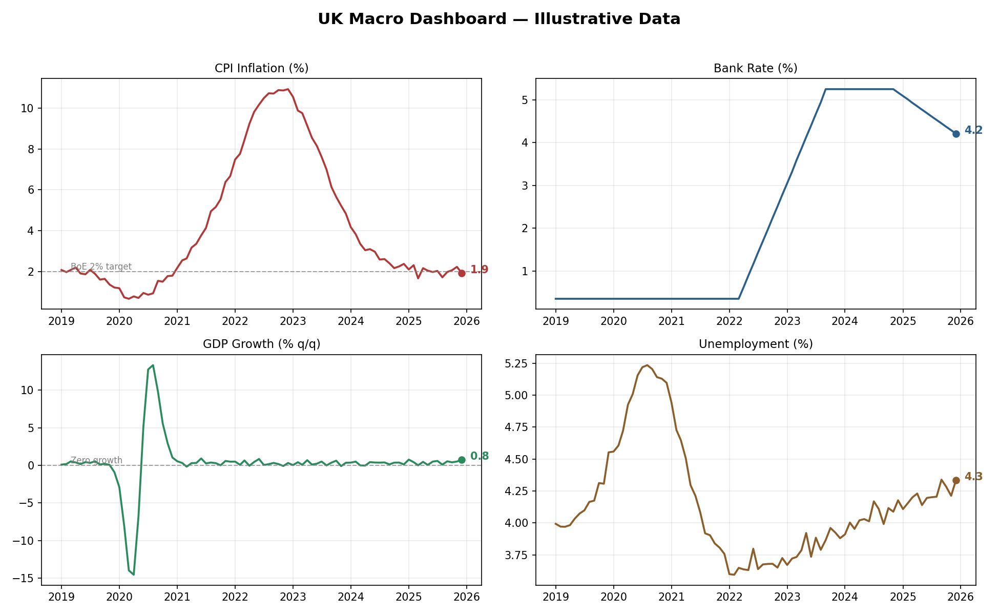

# Macro Economic Dashboard

A four-panel dashboard tracking key UK macro indicators — **CPI inflation, Bank Rate, GDP growth, and unemployment** — with trend annotations and an automated plain-English policy narrative.



## What it does
- Builds a monthly dataset shaped on the broad contours of the UK 2019–2025 cycle (pandemic shock, inflation spike, hiking cycle, normalisation)
- Renders a clean 2×2 dashboard with target lines (e.g. the BoE's 2% inflation target) and latest-value callouts
- Generates a written economic summary, including a rules-based read of the policy stance

## Extending to live data
The data layer is a single function — swap `build_dataset()` for live pulls from the [ONS API](https://developer.ons.gov.uk/) or [FRED](https://fred.stlouisfed.org/docs/api/fred/) (`pip install fredapi`) to make this a production dashboard.

## How to run
```bash
pip install pandas numpy matplotlib
python macro_dashboard.py
```

## Skills demonstrated
Python · data visualisation · economic analysis · dashboard design · API-ready architecture
